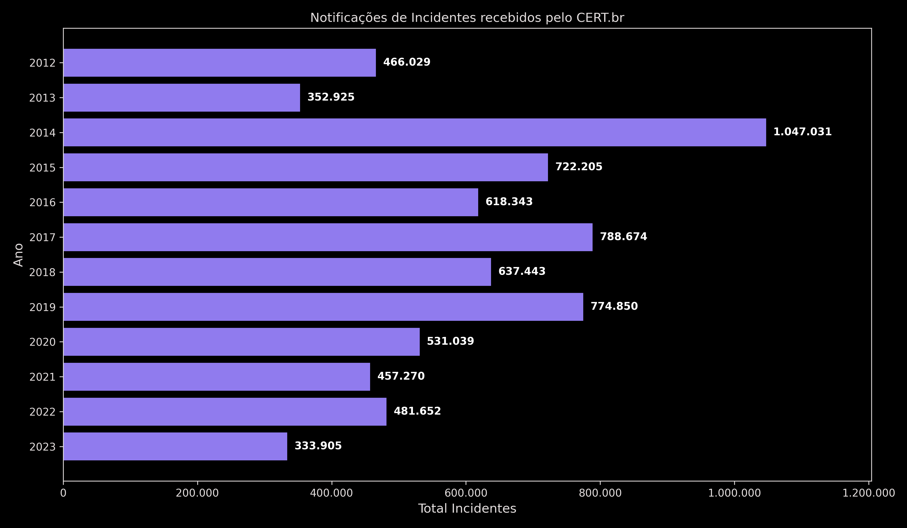
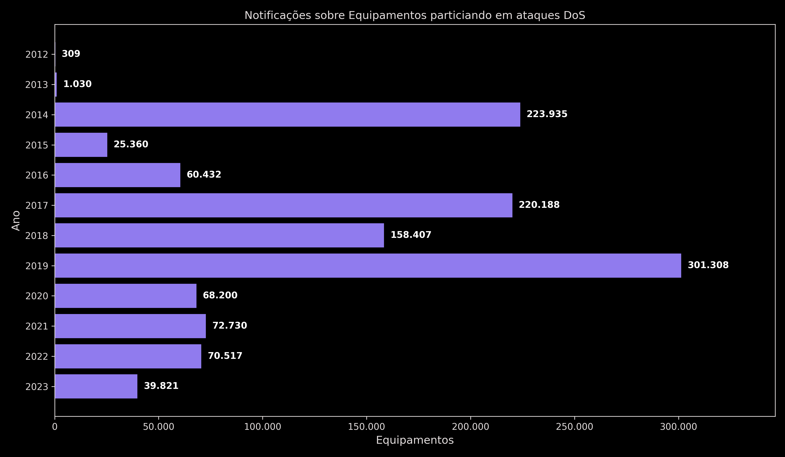
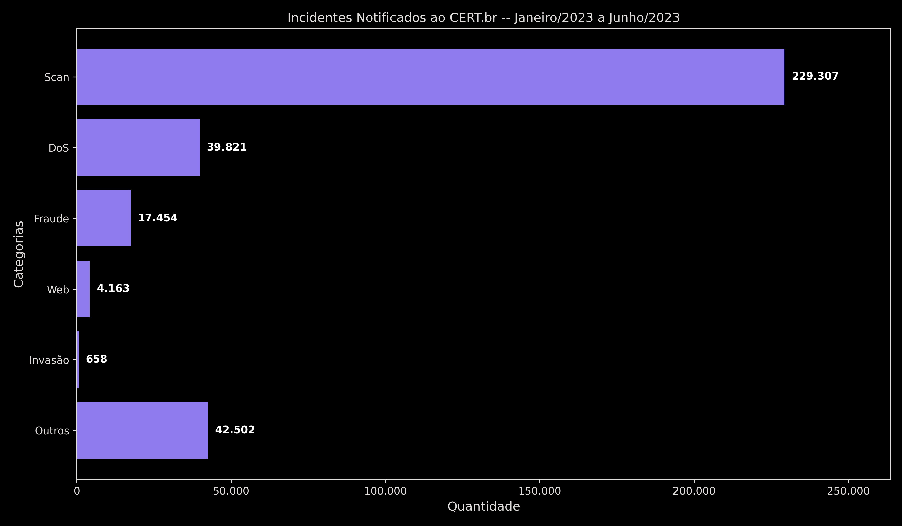
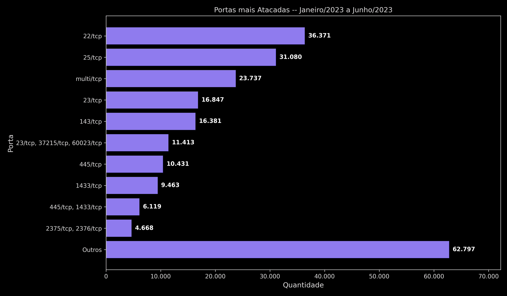
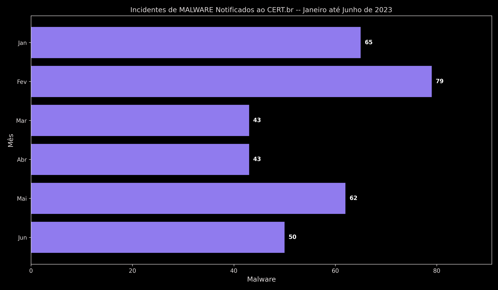
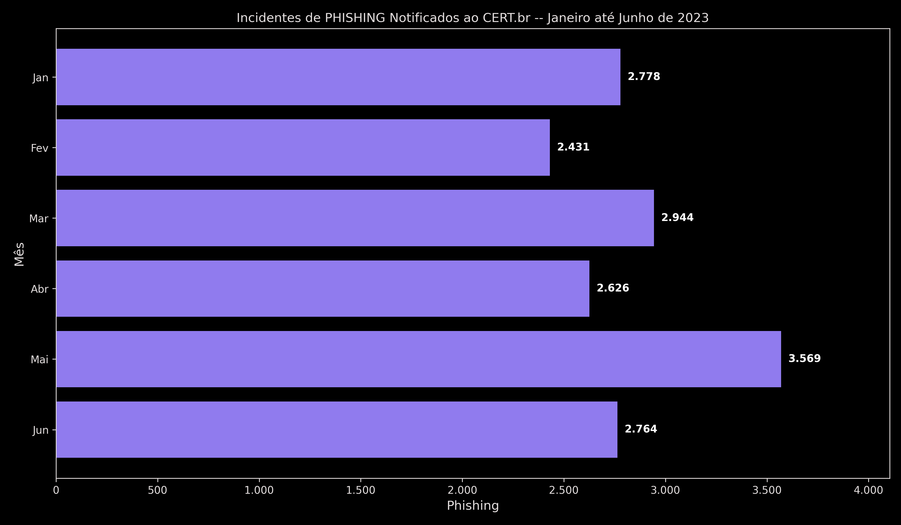
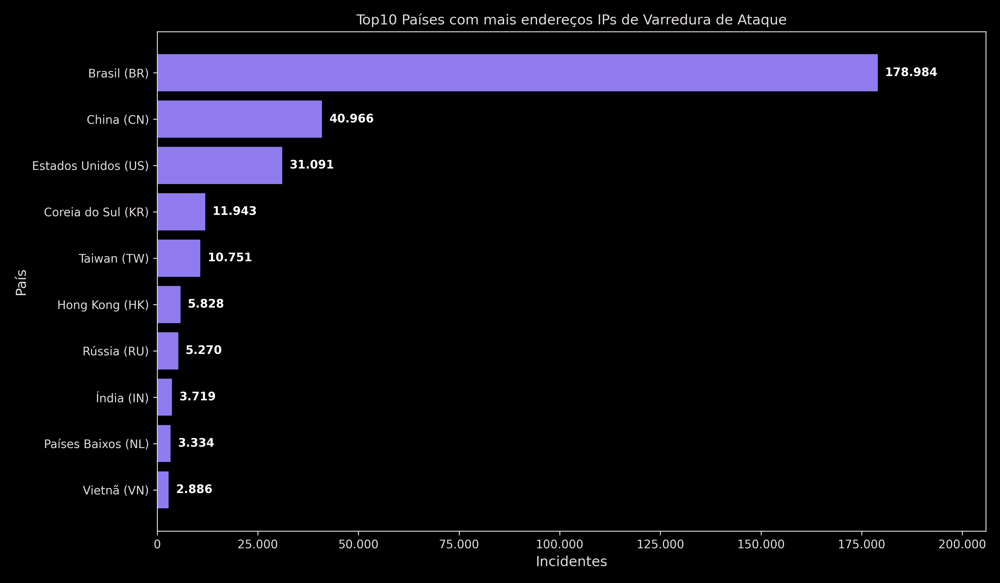
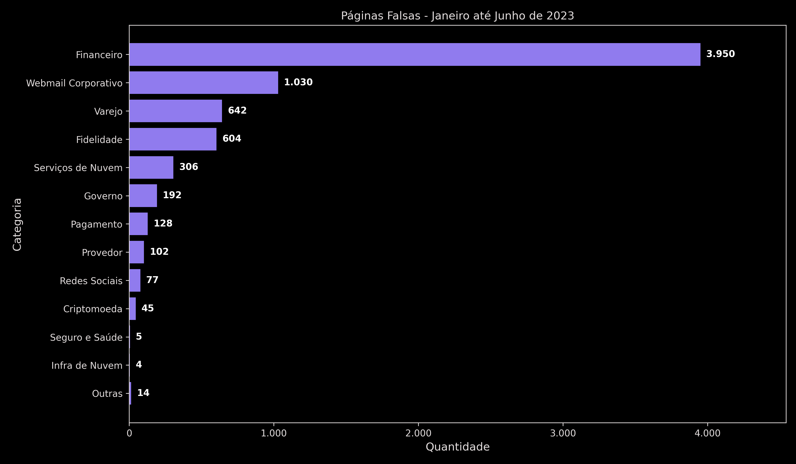

<style>
    /* Reiniciando a Contagem Geral */
    body {
        counter-reset: contadorh1 1 contadorLegenda 0;
    }

    /* Aplica o estilo para H1 e informa que a contagem de H2 deve começar do 0 sempre que um H1 aparecer */
    h1 {
        counter-reset: contadorh2;
        text-align: center;
    }

    h1::before {
        counter-increment: contadorh1;
    }

    /* Aplica o estilo para H2 e informa que a contagem de H3 deve começar do 0 sempre que um H2 aparecer */
    h2 {
        counter-reset: contadorh3;
    }

    h2::before {
        counter-increment: contadorh2;
        content: counter(contadorh2) ". ";
    }

    /* Aplica estilo para H3 */
    h3::before {
        counter-increment: contadorh3;
        content: counter(contadorh2) "." counter(contadorh3) ". ";
    }

    /* Legendas */
    .legenda::before {
    /* Incrementa o contador toda vez que a classe aparece */
    counter-increment: contadorLegenda;
    /* Define o texto automático */
    content: "Figura " counter(contadorLegenda) ": ";
    font-weight: bold;
}
</style>

# Segurança de Dados

> **Última sincronização:** 26/03/2026 10:59:26

## Sumário de Aulas

- Aula 01 - [Apresentação da Disciplina](#apresentação-da-disciplina)
- Aula 02 - [Contextualização a Segurança da Informação](#contextualização-a-segurança-da-informação)
- Aula 04 - [Criptografia de Chave Simétrica](#criptografia-de-chave-simétrica)

---

## Apresentação da Disciplina

- Arquivo da [aula 01]().
- Data da Postagem: 11/03/2026

### Tópicos

- Apresentação do Professor
- Experiência Profissional
- [Dados Gerais](#dados-gerais)
- As redes de Computadores
  - Breve Histórico
- Motivação da Disciplina
- Objetivo Geral
- Objetivos Específicos
- Ementa
- [Conteúdo Programático](#conteúdo-programático)
- [Avaliações](#critérios-de-avaliação)
- Bibliografia

### Dados Gerais

- Carga Horária (CH): 120h
- Aulas
  - Quintas: 09:45 - 11:25 (últimas duas aulas)
  - Sexta: 07:00 - 08:40 (primeiras duas aulas)
  - Local: Laboratório de Informática 06
- Número de Avaliações: 4

### Conteúdo Programático

1. Histórico e Motivação para uso das redes de computadores
2. Topologias físicas e lógicas de redes de computadores
3. Transmissão da Informação
   1. Sinais: analógico e digital
   2. Fontes de Distorção nos Enlaces
   3. Teoremas de Nyquist e Shannon
   4. Multiplexação e seus tipos
4. Comunicação e seus tipos
5. Meios de transmissão: com e sem fio
6. Introdução à Arquitetura de Redes
7. O Modelo RM-OSI
   1. Motivação
   2. Camadas e suas funções
8. Confeccionando cabos de rede (par traçado UTP 5e) - Prática
9. O Padrão IEEE 802
   1.  Motivação
   2.  Camadas e suas funções
   3.  Comparação com o RM-OSI
   4.  Padrões
10. Arquitetura TCP/IP
    1.  Camadas e suas funções
    2.  Comparação com o RM-OSI e IEEE 802
    3.  Camadas: Protocolos e suas funções
11. Internet ou Inter-Rede
    1.  Endereçamento IP
    2.  Datagrama IP
    3.  ARP e RARP
    4.  NAT
12. Redes Virtuais e Software-Defined Networks (SDN)
    1.  Montagem e Avaliação
    2.  Controladores e Simulador SDN (Mininet)
    3.  Protocolos de Tunelamento em SDN com Prática
13. Transporte
    1.  TCP
    2.  Cabeçalho
    3.  Algoritmos de Controle de Congestionamento
    4.  UDP
    5.  SCTP
14. Aplicação
    1.  HTTPS
    2.  DNS
    3.  SSH

### Critérios de Avaliação

&emsp; Quatro avaliações:

- 2 provas subjetivas(s)/objetiva(s)
- 1 prática
- 1 seminário com apresentação de artigos científicos

---

## Contextualização a Segurança da Informação

- Arquivo da [aula 02]().
- Data de Postagem: 12/03/2026

### Sumário

- [Contextualização a Segurança da Informação](#contextualização-a-segurança-da-informação)
  - [Sumário](#sumário)
  - [Problematização](#problematização)
  - [Evolução da Segurança da Informação](#evolução-da-segurança-da-informação)
  - [Pilares da Segurança da Informação](#pilares-da-segurança-da-informação)
  - [Criptografia](#criptografia)
  - [Tipos de Criptografia](#tipos-de-criptografia)
  - [Controle de Acesso](#controle-de-acesso)
  - [CERT.BR](#certbr)
  - [Incidentes de Segurança](#incidentes-de-segurança)

### Problematização

&emsp; As informações são os bens mais preciosos que possuímos hoje em dia, por isso veremos um dos principais focos das empresas que é a **Segurança de Dados** e como ela pode proteger esse bem tão precioso que temos.

### Evolução da Segurança da Informação

- 1940 - Mark I
  - Aplicação: Otimizar a trajetória dos mísseis
- 1957 - Satélite Sputnik
- 1962 - Arpanet ou Darpanet (Defense Advanced Research Projects Agency)
  - Aplicação: Trocar dados sigilosos entre bases militares, mesmo quando uma ou várias destas ficarem sem conexão, funcionando em forma de grafo

- 1970 - Início da Arquitetura TCP/IP
  - E-mail (1969) e Primeira aplicação: 1972
  - DNS
  - TCP evolução do NCP
  - [x] Store and Forward (único mecanismo de segurança) [1]
  - [x] Fim da década de 70: separação do TCP em 'TCP' e 'IP'

- 1980
  - Popularização dos Computadores
  - Padronização TCP/IP (1983) [2]
  - NFSNET
  - Surgimento da Cultura Hacker [3]
  - WWW (1989)

- 1990
  - Internet
  - Vândalos da Internet
  - Wireless Fidelity (Wi-Fi)

- 2000/2010/2020
  - Crimes profissionais na internet
  - Popularização da Computação Móvel
  - Computação em Nuvem
  - IoT (MANET, VANET, etc)
  - SDN, 5G
  - Smart Cities

### Pilares da Segurança da Informação

- Estados da Informação
  - Transmissão
  - Armazenamento
  - Processamento
- Propriedades da Segurança da Informação
  - Confidencialidade
  - Integridade
  - Disponibilidade
- Medidas de Segurança
  - Tecnologias
  - Políticas e Procedimentos
  - Conscientização

&emsp; As informações estão em diversos locais e a segurança depende de múltiplos fatores. Imagine cada **Pilar de Segurança** sendo uma face de um cubo.

- CID [5]
  - **Confidencialidade**: visa impedir a leitura não autorizada de informações.
  - **Integridade**: se dá, caso uma escrita não autorizada for proibida.
  - **Disponibilidade**: fazer com que os sistemas estejam sempre disponíveis ao usuário.
- Segundo [5]
  - **Criptologia**: é a arte e a ciência de fazer e quebrar "códigos secretos".
  - A **Criptografia** é a criação de "códigos secretos".
  - **Criptoanálise** é a ruptura de "códigos secretos".

### Criptografia

&emsp; De acordo com [6]:

- Teve origem no Egito, em meados de 1900 A.C.
- Usado no Império Romano com a Cifra de César (substituição por _n_)
- Disco de Cifra - Início da Mecanização de Cifragem
  - Século XV: italiano Leon Battista Alberti (1404-1472) com dois cilindros para implementar a Cifra de César
  - Século XVIII: cilindro de Jefferson (Thomas Jefferson) com 36 discos implementando uma cifra de substituição polialfabética.
  - Cifra polialfabética consiste em usar uma tabela 26x26 que cria 26 alfabetos.
- Em 1918, Arthur Scherbius patenteou a máquina de criptografia denominada Enigma. [Vídeo de explicação](https://www.youtube.com/watch?v=mdSvGUd0_c).
  - Baseada no Princípio de Kerchhoff
- Em 1949, Claude Shannon criou a Teoria Matemática da Comunicação ([link de vídeo](https://www.youtube.com/watch?v=yIEnE-jfI54)).
- Em 1972: DES (Data Encryption Standard)
- Década de 90: AES (Advanced Encryption Standard).

```js
plain_text = [a, b, c, d, e, f, g, h, i, j, k, l, m, n, o, p, q, r, s, t, u, v, w, x, y, z]

cipher_text = [D, E, F, G, H, I, J, K, L, M, N, O, P, Q, R, S, T, U, V, W, X, Y, Z, A, B, C]
```

<p align="right" class="legenda">
  <ins><i>Cifra de César com n = 3</i></ins>
</p>

### Tipos de Criptografia

- **Simétrica**: só uma chave é compartilhada entre origem e destino. Exemplos:
  - RC4
  - A5/1
  - DES (3DES)
  - AES
- **Assimétrica** ou **Criptografia de Chaves**: um par de chaves é trocado, uma para cifrar (pública) e outra diferente para decifrar (privada). Exemplos:
  - RSA
  - Curvas Elípticas

&emsp; Exemplos de Tipos de Criptografia:

```txt
1. Mensagem original enviada
2. Algoritmo de criptografar (Chave Secreta Compartilhada)
3. Texto Cifrado (Meio Seguro)
4. Algoritmo de descriptografar (Chave Secreta Compartilhada)
5. Mensagem original recebida
```

<p align="right" class="legenda">
  <ins><i>Criptografia Simétrica</i></ins>
</p>

```txt
1. Mensagem original enviada
2. Algoritmo para criptografar (Chave Pública)
3. Texto cifrado
4. Algoritmo para descriptografar (Chave Privada)
5. Mensagem original recebida
```

<p align="right" class="legenda">
  <ins><i>Criptografia Assimétrica</i></ins>
</p>

### Controle de Acesso

- **Autenticação**: forma de um usuário provar que ele é ele mesmo, através de provar:
  - Algo que você sabe (senha)
  - Algo que você tem (smartcard, cartão de banco, assinatura digital)
  - Algo que você é (biometria: leitor digital, leitor da íris e análise da palma da mão)
- **Autorização**: após a autenticação, o usuário estará apto ao sistema, seguindo restrições impostas pelo mesmo

### CERT.BR

> &emsp; Grupo de Resposta a Incidentes de Segurança para a Internet no Brasil. mantido pelo NIC.br, do Comitê Gestor da Internet no Brasil. É responsável por tratar incidentes de segurança em computadores que envolvam redes conectadas à Internet no Brasil.
>
> &emsp; Atua como um ponto central para notificações de incidentes de segurança no Brasil, provendo a coordenação e o apoio no processo de resposta a incidentes e, quando necessário, colocando as partes envolvidas em contato.
>
> &emsp; Além do processo de tratamento a incidentes em si, o CERT.br também atua através do trabalho de conscientização sobre os problemas de segurança, da análise de tendências e correlação entre eventos na Internet brasileira e do auxílio ao estabelecimento de novos CSIRTs no Brasil.
>
> &emsp; Estas atividades têm como objetivo estratégico aumentar os níveis de segurança e de capacidade de tratamento de incidentes das redes conectadas à Internet no Brasil.
>
> &emsp; As atividades conduzidas pelo CERT.br fazem parte das atribuições do CGI.br de:
> 
> - I - estabelecer diretrizes estratégicas relacionadas ao uso e desenvolvimento da Internet no Brasil;
> - IV - promover estudos e recomendar procedimentos, normas e padrões técnicos e operacionais, para a
segurança das redes e serviços de Internet, bem assim para a sua crescente e adequada utilização pela sociedade
> - VI - ser representado nos fóruns técnicos nacionais e internacionais relativos à Internet; Bem como dos objetivos do NIC.br, conforme seu Estatuto:
> - IV - atender aos requisitos de segurança e emergências na Internet Brasileira em articulação e cooperação com as entidades e os órgãos responsáveis;
> - VII - promover ou colaborar na realização de cursos, simpósios, seminários, conferências, feiras e congressos, visando contribuir para o desenvolvimento e aperfeiçoamento do ensino e dos conhecimentos nas áreas de suas especialidades.

### Incidentes de Segurança

&emsp; Como afirma o CERT (Centro de Estudos, Resposta e Tratamento de Incidentes de Segurança no Brasil), em [5]:

> "Qualquer evento adverso, confirmado ou sob suspeita, relacionado à segurança dos sistemas de computação ou das redes de computadores".
>
> "O ato de violar uma política de segurança, explícita e implícita".



<p align="right" class="legenda">
  <ins><i>Incidentes de Segurança reportados entre 2012 e 2023.</i></ins>
</p>



<p align="right" class="legenda">
  <ins><i>Equipamentos participando de Ataques DoS.</i></ins>
</p>



<p align="right" class="legenda">
  <ins><i>Categorias de Incidentes Notificados (CERT.br) - Janeiro/2023 até Junho/2023.</i></ins>
</p>



<p align="right" class="legenda">
  <ins><i>Portas mais Atacadas - Janeiro/2023 até Junho/2023.</i></ins>
</p>



<p align="right" class="legenda">
  <ins><i>Malwares reportados ao CERT.br - Janeiro/2023 até Junho/2023.</i></ins>
</p>



<p align="right" class="legenda">
  <ins><i>Phishings reportados ao CERT.br - Janeiro/2023 até Junho/2023.</i></ins>
</p>



<p align="right" class="legenda">
  <ins><i>Top10 países que possuem mais origem de endereços de IP de varredura.</i></ins>
</p>



<p align="right" class="legenda">
  <ins><i>Quantidade de Páginas Falsas - Janeiro/2023 até Junho/2023.</i></ins>
</p>


---

## Criptografia de Chave Simétrica

- Aula: 26/03/2026

### Tópicos

- [Criptografia de Chave Simétrica](#criptografia-de-chave-simétrica)
  - [Tópicos](#tópicos)


---

