<style>
    /* Reiniciando a Contagem Geral */
    body {
        counter-reset: contadorh1 1 contadorLegenda 0;
    }

    /* Aplica o estilo para H1 e informa que a contagem de H2 deve começar do 0 sempre que um H1 aparecer */
    h1 {
        counter-reset: contadorh2;
        text-align: center;
    }

    h1::before {
        counter-increment: contadorh1;
    }

    /* Aplica o estilo para H2 e informa que a contagem de H3 deve começar do 0 sempre que um H2 aparecer */
    h2 {
        counter-reset: contadorh3;
    }

    h2::before {
        counter-increment: contadorh2;
        content: counter(contadorh2) ". ";
    }

    /* Aplica estilo para H3 */
    h3::before {
        counter-increment: contadorh3;
        content: counter(contadorh2) "." counter(contadorh3) ". ";
    }

    /* Legendas */
    .legenda::before {
    /* Incrementa o contador toda vez que a classe aparece */
    counter-increment: contadorLegenda;
    /* Define o texto automático */
    content: "Figura " counter(contadorLegenda) ": ";
    font-weight: bold;
}
</style>

# Segurança de Dados

> **Última sincronização:** 16/04/2026 16:22:30

## Sumário de Aulas

- Aula 01 - [Apresentação da Disciplina](#apresentação-da-disciplina)
- Aula 02 - [Contextualização a Segurança da Informação](#contextualização-a-segurança-da-informação)
- Aula 03 - [Criptografia Básica](#criptografia-básica)
- Aula 04 - [Criptografia de Chave Simétrica](#criptografia-de-chave-simétrica)
- Aula 07 - [Márquinas Virtuais](#márquinas-virtuais)

---

## Apresentação da Disciplina

- Arquivo da [aula 01]().
- Data da Postagem: 11/03/2026

### Tópicos

- Apresentação do Professor
- Experiência Profissional
- [Dados Gerais](#dados-gerais)
- As redes de Computadores
  - Breve Histórico
- Motivação da Disciplina
- Objetivo Geral
- Objetivos Específicos
- Ementa
- [Conteúdo Programático](#conteúdo-programático)
- [Avaliações](#critérios-de-avaliação)
- Bibliografia

### Dados Gerais

- Carga Horária (CH): 120h
- Aulas
  - Quintas: 09:45 - 11:25 (últimas duas aulas)
  - Sexta: 07:00 - 08:40 (primeiras duas aulas)
  - Local: Laboratório de Informática 06
- Número de Avaliações: 4

### Conteúdo Programático

1. Histórico e Motivação para uso das redes de computadores
2. Topologias físicas e lógicas de redes de computadores
3. Transmissão da Informação
   1. Sinais: analógico e digital
   2. Fontes de Distorção nos Enlaces
   3. Teoremas de Nyquist e Shannon
   4. Multiplexação e seus tipos
4. Comunicação e seus tipos
5. Meios de transmissão: com e sem fio
6. Introdução à Arquitetura de Redes
7. O Modelo RM-OSI
   1. Motivação
   2. Camadas e suas funções
8. Confeccionando cabos de rede (par traçado UTP 5e) - Prática
9. O Padrão IEEE 802
   1.  Motivação
   2.  Camadas e suas funções
   3.  Comparação com o RM-OSI
   4.  Padrões
10. Arquitetura TCP/IP
    1.  Camadas e suas funções
    2.  Comparação com o RM-OSI e IEEE 802
    3.  Camadas: Protocolos e suas funções
11. Internet ou Inter-Rede
    1.  Endereçamento IP
    2.  Datagrama IP
    3.  ARP e RARP
    4.  NAT
12. Redes Virtuais e Software-Defined Networks (SDN)
    1.  Montagem e Avaliação
    2.  Controladores e Simulador SDN (Mininet)
    3.  Protocolos de Tunelamento em SDN com Prática
13. Transporte
    1.  TCP
    2.  Cabeçalho
    3.  Algoritmos de Controle de Congestionamento
    4.  UDP
    5.  SCTP
14. Aplicação
    1.  HTTPS
    2.  DNS
    3.  SSH

### Critérios de Avaliação

&emsp; Quatro avaliações:

- 2 provas subjetivas(s)/objetiva(s)
- 1 prática
- 1 seminário com apresentação de artigos científicos

---

## Contextualização a Segurança da Informação

- Arquivo da [aula 02]().
- Data de Postagem: 12/03/2026

### Sumário

- [Contextualização a Segurança da Informação](#contextualização-a-segurança-da-informação)
  - [Sumário](#sumário)
  - [Problematização](#problematização)
  - [Evolução da Segurança da Informação](#evolução-da-segurança-da-informação)
  - [Pilares da Segurança da Informação](#pilares-da-segurança-da-informação)
  - [Criptografia](#criptografia)
  - [Tipos de Criptografia](#tipos-de-criptografia)
  - [Controle de Acesso](#controle-de-acesso)
  - [CERT.BR](#certbr)
  - [Incidentes de Segurança](#incidentes-de-segurança)
  - [Estatísticas de Ataques de Amplificação](#estatísticas-de-ataques-de-amplificação)
  - [Estatísticas de DNS maliciosos](#estatísticas-de-dns-maliciosos)
    - [ATENÇÃO](#atenção)
  - [Estatísticas de SPAM](#estatísticas-de-spam)
  - [As 20 Portas TCP que mais sofreram varreduras em 2020](#as-20-portas-tcp-que-mais-sofreram-varreduras-em-2020)
  - [Ataques por Número de Sistema Autônomo (ASN)](#ataques-por-número-de-sistema-autônomo-asn)
  - [Ataques a Servidores Web](#ataques-a-servidores-web)
  - [Nomas ISO](#nomas-iso)
  - [Recomendações Mercadológicas](#recomendações-mercadológicas)
    - [COBIT: Control Objectives for Information and related Technology](#cobit-control-objectives-for-information-and-related-technology)
    - [Information Technology Infrastructure Library (ITIL)](#information-technology-infrastructure-library-itil)
  - [Reflexão](#reflexão)
  - [Referências](#referências)

### Problematização

&emsp; As informações são os bens mais preciosos que possuímos hoje em dia, por isso veremos um dos principais focos das empresas que é a **Segurança de Dados** e como ela pode proteger esse bem tão precioso que temos.

### Evolução da Segurança da Informação

- 1940 - Mark I
  - Aplicação: Otimizar a trajetória dos mísseis
- 1957 - Satélite Sputnik
- 1962 - Arpanet ou Darpanet (Defense Advanced Research Projects Agency)
  - Aplicação: Trocar dados sigilosos entre bases militares, mesmo quando uma ou várias destas ficarem sem conexão, funcionando em forma de grafo

- 1970 - Início da Arquitetura TCP/IP
  - E-mail (1969) e Primeira aplicação: 1972
  - DNS
  - TCP evolução do NCP
  - [x] Store and Forward (único mecanismo de segurança) [1]
  - [x] Fim da década de 70: separação do TCP em 'TCP' e 'IP'

- 1980
  - Popularização dos Computadores
  - Padronização TCP/IP (1983) [2]
  - NFSNET
  - Surgimento da Cultura Hacker [3]
  - WWW (1989)

- 1990
  - Internet
  - Vândalos da Internet
  - Wireless Fidelity (Wi-Fi)

- 2000/2010/2020
  - Crimes profissionais na internet
  - Popularização da Computação Móvel
  - Computação em Nuvem
  - IoT (MANET, VANET, etc)
  - SDN, 5G
  - Smart Cities

### Pilares da Segurança da Informação

- Estados da Informação
  - Transmissão
  - Armazenamento
  - Processamento
- Propriedades da Segurança da Informação
  - Confidencialidade
  - Integridade
  - Disponibilidade
- Medidas de Segurança
  - Tecnologias
  - Políticas e Procedimentos
  - Conscientização

&emsp; As informações estão em diversos locais e a segurança depende de múltiplos fatores. Imagine cada **Pilar de Segurança** sendo uma face de um cubo.

- CID [5]
  - **Confidencialidade**: visa impedir a leitura não autorizada de informações.
  - **Integridade**: se dá, caso uma escrita não autorizada for proibida.
  - **Disponibilidade**: fazer com que os sistemas estejam sempre disponíveis ao usuário.
- Segundo [5]
  - **Criptologia**: é a arte e a ciência de fazer e quebrar "códigos secretos".
  - A **Criptografia** é a criação de "códigos secretos".
  - **Criptoanálise** é a ruptura de "códigos secretos".

### Criptografia

&emsp; De acordo com [6]:

- Teve origem no Egito, em meados de 1900 A.C.
- Usado no Império Romano com a Cifra de César (substituição por _n_)
- Disco de Cifra - Início da Mecanização de Cifragem
  - Século XV: italiano Leon Battista Alberti (1404-1472) com dois cilindros para implementar a Cifra de César
  - Século XVIII: cilindro de Jefferson (Thomas Jefferson) com 36 discos implementando uma cifra de substituição polialfabética.
  - Cifra polialfabética consiste em usar uma tabela 26x26 que cria 26 alfabetos.
- Em 1918, Arthur Scherbius patenteou a máquina de criptografia denominada Enigma. [Vídeo de explicação](https://www.youtube.com/watch?v=mdSvGUd0_c).
  - Baseada no Princípio de Kerchhoff
- Em 1949, Claude Shannon criou a Teoria Matemática da Comunicação ([link de vídeo](https://www.youtube.com/watch?v=yIEnE-jfI54)).
- Em 1972: DES (Data Encryption Standard)
- Década de 90: AES (Advanced Encryption Standard).

```js
plain_text = [a, b, c, d, e, f, g, h, i, j, k, l, m, n, o, p, q, r, s, t, u, v, w, x, y, z]

cipher_text = [D, E, F, G, H, I, J, K, L, M, N, O, P, Q, R, S, T, U, V, W, X, Y, Z, A, B, C]
```

<p align="right" class="legenda">
  <ins><i>Cifra de César com n = 3</i></ins>
</p>

### Tipos de Criptografia

- **Simétrica**: só uma chave é compartilhada entre origem e destino. Exemplos:
  - RC4
  - A5/1
  - DES (3DES)
  - AES
- **Assimétrica** ou **Criptografia de Chaves**: um par de chaves é trocado, uma para cifrar (pública) e outra diferente para decifrar (privada). Exemplos:
  - RSA
  - Curvas Elípticas

&emsp; Exemplos de Tipos de Criptografia:

```txt
1. Mensagem original enviada
2. Algoritmo de criptografar (Chave Secreta Compartilhada)
3. Texto Cifrado (Meio Seguro)
4. Algoritmo de descriptografar (Chave Secreta Compartilhada)
5. Mensagem original recebida
```

<p align="right" class="legenda">
  <ins><i>Criptografia Simétrica</i></ins>
</p>

```txt
1. Mensagem original enviada
2. Algoritmo para criptografar (Chave Pública)
3. Texto cifrado
4. Algoritmo para descriptografar (Chave Privada)
5. Mensagem original recebida
```

<p align="right" class="legenda">
  <ins><i>Criptografia Assimétrica</i></ins>
</p>

### Controle de Acesso

- **Autenticação**: forma de um usuário provar que ele é ele mesmo, através de provar:
  - Algo que você sabe (senha)
  - Algo que você tem (smartcard, cartão de banco, assinatura digital)
  - Algo que você é (biometria: leitor digital, leitor da íris e análise da palma da mão)
- **Autorização**: após a autenticação, o usuário estará apto ao sistema, seguindo restrições impostas pelo mesmo

### CERT.BR

> &emsp; Grupo de Resposta a Incidentes de Segurança para a Internet no Brasil. mantido pelo NIC.br, do Comitê Gestor da Internet no Brasil. É responsável por tratar incidentes de segurança em computadores que envolvam redes conectadas à Internet no Brasil.
>
> &emsp; Atua como um ponto central para notificações de incidentes de segurança no Brasil, provendo a coordenação e o apoio no processo de resposta a incidentes e, quando necessário, colocando as partes envolvidas em contato.
>
> &emsp; Além do processo de tratamento a incidentes em si, o CERT.br também atua através do trabalho de conscientização sobre os problemas de segurança, da análise de tendências e correlação entre eventos na Internet brasileira e do auxílio ao estabelecimento de novos CSIRTs no Brasil.
>
> &emsp; Estas atividades têm como objetivo estratégico aumentar os níveis de segurança e de capacidade de tratamento de incidentes das redes conectadas à Internet no Brasil.
>
> &emsp; As atividades conduzidas pelo CERT.br fazem parte das atribuições do CGI.br de:
> 
> - I - estabelecer diretrizes estratégicas relacionadas ao uso e desenvolvimento da Internet no Brasil;
> - IV - promover estudos e recomendar procedimentos, normas e padrões técnicos e operacionais, para a
segurança das redes e serviços de Internet, bem assim para a sua crescente e adequada utilização pela sociedade
> - VI - ser representado nos fóruns técnicos nacionais e internacionais relativos à Internet; Bem como dos objetivos do NIC.br, conforme seu Estatuto:
> - IV - atender aos requisitos de segurança e emergências na Internet Brasileira em articulação e cooperação com as entidades e os órgãos responsáveis;
> - VII - promover ou colaborar na realização de cursos, simpósios, seminários, conferências, feiras e congressos, visando contribuir para o desenvolvimento e aperfeiçoamento do ensino e dos conhecimentos nas áreas de suas especialidades.

### Incidentes de Segurança

&emsp; Como afirma o CERT (Centro de Estudos, Resposta e Tratamento de Incidentes de Segurança no Brasil), em [5]:

> "Qualquer evento adverso, confirmado ou sob suspeita, relacionado à segurança dos sistemas de computação ou das redes de computadores".
>
> "O ato de violar uma política de segurança, explícita e implícita".

&emsp; Ainda segundo o CERT:

- **Worm**: notificações de atividades maliciosas relacionadas com o processo automatizado de propagação de códigos maliciosos na rede.
- **(DoS -- Denial of Service)**: notificações de ataques de negação de serviço, onde atacante utiliza um computador ou um conjunto de computadores para tirar de operação um serviço, computador ou rede.
- **Invasão**: um ataque bem sucedido que resulte no acesso não autorizado a um computador ou rede.
- **Web**: um caso particular de ataque visando especificamente o comprometimento de servidores Web ou desfigurações de páginas na Internet.
- **Scan**: notificações de varreduras em redes de computadores, com o intuito de identificar quais computadores estão ativos e quais serviços estão sendo disponibilizados por eles. É amplamente utilizado por atacantes para identificar potenciais alvos, pois permite associar possíveis vulnerabilidades aos serviços habilitados em um computador.
- **Fraude**: segundo Houaiss, é "qualquer ato ardiloso, enganoso, de má-fé, com intuito de lesar ou ludibriar outrem, ou de não cumprir determinado dever; logro". Esta categoria engloba as notificações de tentativas de fraudes, ou seja, de incidentes em que ocorre uma tentativa de obter vantagem.
- **Outros**: notificações de incidentes que não se enquadram nas categorias anteriores.


<p align="right" class="legenda">
  <ins><i>Incidentes de Segurança reportados entre 2012 e 2023.</i></ins>
</p>


<p align="right" class="legenda">
  <ins><i>Equipamentos participando de Ataques DoS.</i></ins>
</p>


<p align="right" class="legenda">
  <ins><i>Categorias de Incidentes Notificados (CERT.br) - Janeiro/2023 até Junho/2023.</i></ins>
</p>


<p align="right" class="legenda">
  <ins><i>Portas mais Atacadas - Janeiro/2023 até Junho/2023.</i></ins>
</p>


<p align="right" class="legenda">
  <ins><i>Malwares reportados ao CERT.br - Janeiro/2023 até Junho/2023.</i></ins>
</p>


<p align="right" class="legenda">
  <ins><i>Phishings reportados ao CERT.br - Janeiro/2023 até Junho/2023.</i></ins>
</p>


<p align="right" class="legenda">
  <ins><i>Top10 países que possuem mais origem de endereços de IP de varredura - Janeiro/2023 até Junho/2023.</i></ins>
</p>


<p align="right" class="legenda">
  <ins><i>Quantidade de Páginas Falsas - Janeiro/2023 até Junho/2023.</i></ins>
</p>

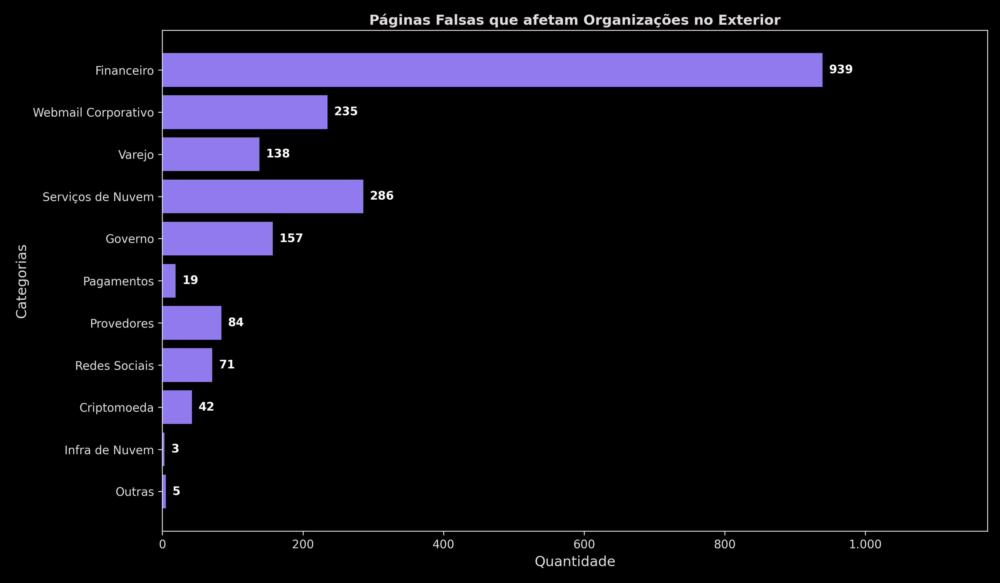

<p align="right" class="legenda">
  <ins><i>Categorias de Páginas Falsas que afetam Organizações no Exterior -- Janeiro a Junho de 2023.</i></ins>
</p>

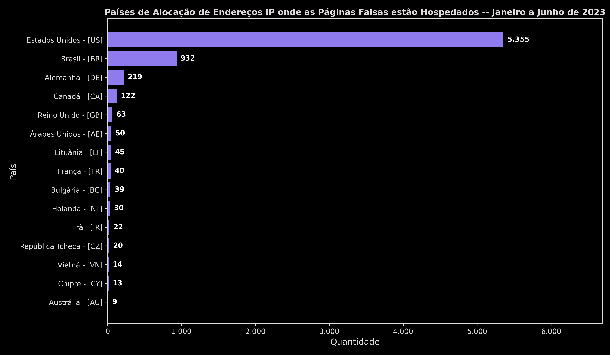

<p align="right" class="legenda">
  <ins><i>Países de Alocação de Endereços IP onde as Páginas Falsas estão Hospedados -- Janeiro a Junho de 2023</i></ins>
</p>

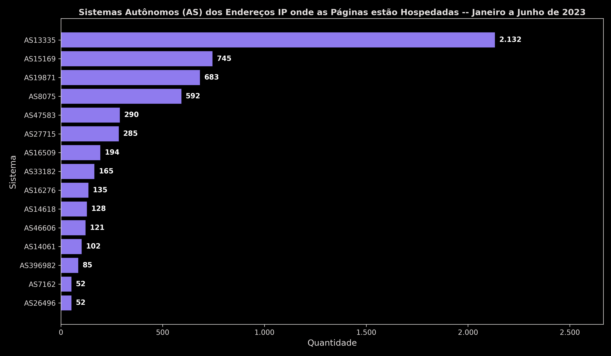

<p align="right" class="legenda">
  <ins><i>Sistemas Autônomos (AS) dos Endereços IP onde as Páginas estão Hospedadas -- Janeiro a Junho de 2023</i></ins>
</p>

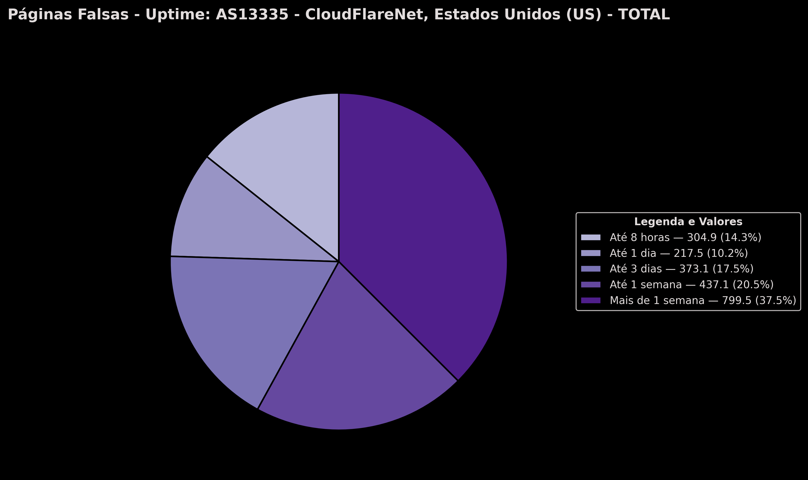

<p align="right" class="legenda">
  <ins><i>Páginas Falsas - Uptime: AS13335 - CloudFlareNet, Estados Unidos (US) - TOTAL -- Janeiro a Junho de 2023</i></ins>
</p>


<p align="right" class="legenda">
  <ins><i>Páginas Falsas - Uptime: AS13335 - CloudFlareNet, Estados Unidos (US) - BRASIL -- Janeiro a Junho de 2023</i></ins>
</p>

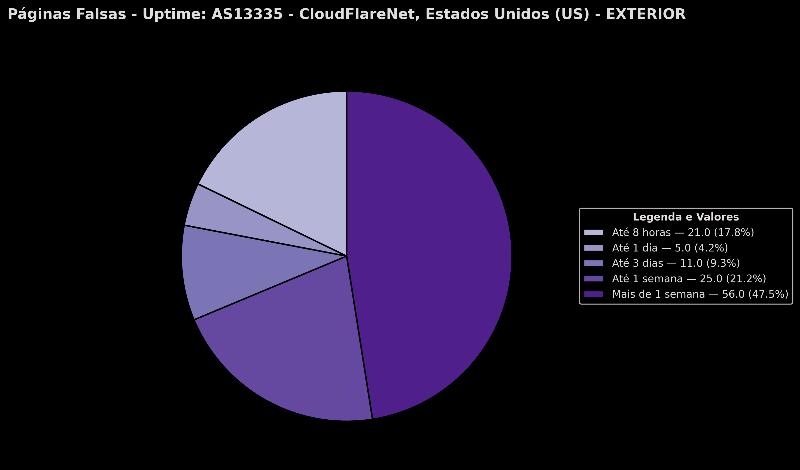

<p align="right" class="legenda">
  <ins><i>Páginas Falsas - Uptime: AS13335 - CloudFlareNet, Estados Unidos (US) - EXTERIOR -- Janeiro a Junho de 2023</i></ins>
</p>

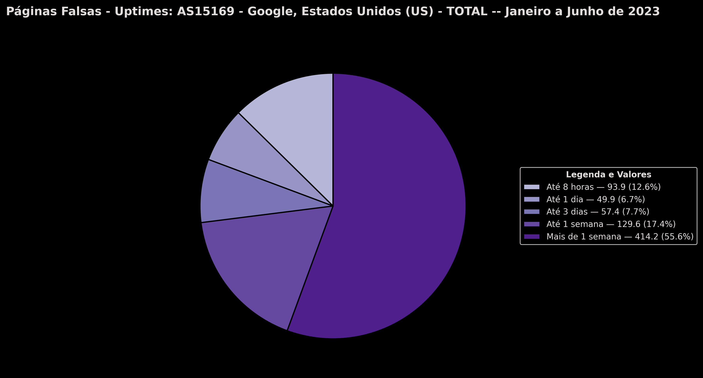

<p align="right" class="legenda">
  <ins><i>Páginas Falsas - Uptimes: AS15169 - Google, Estados Unidos (US) - TOTAL -- Janeiro a Junho de 2023</i></ins>
</p>

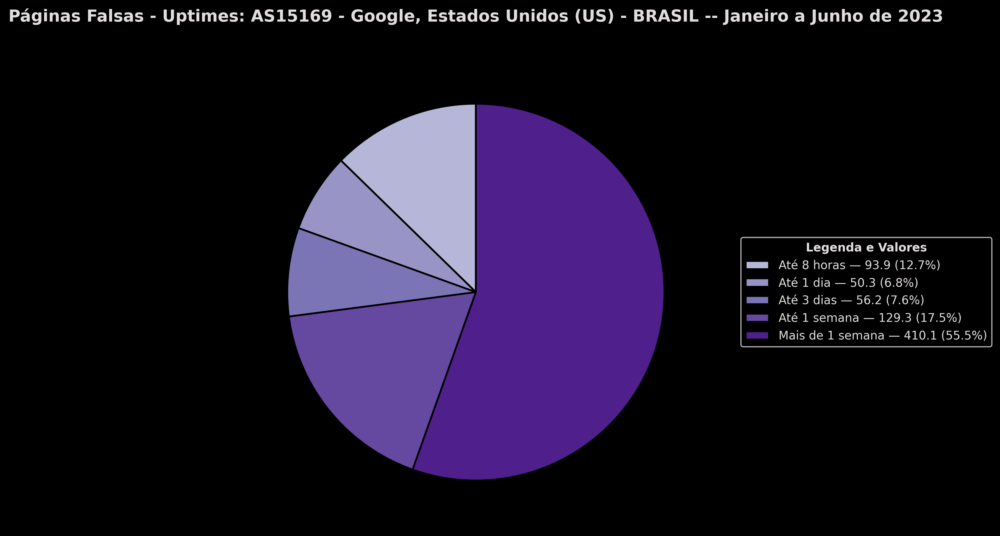

<p align="right" class="legenda">
  <ins><i>Páginas Falsas - Uptimes: AS15169 - Google, Estados Unidos (US) - BRASIL -- Janeiro a Junho de 2023</i></ins>
</p>

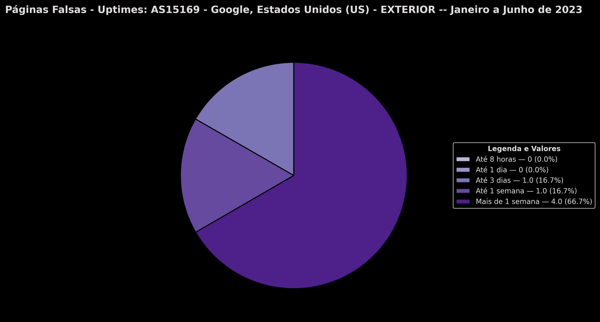

<p align="right" class="legenda">
  <ins><i>Páginas Falsas - Uptimes: AS15169 - Google, Estados Unidos (US) - EXTERIOR -- Janeiro a Junho de 2023</i></ins>
</p>

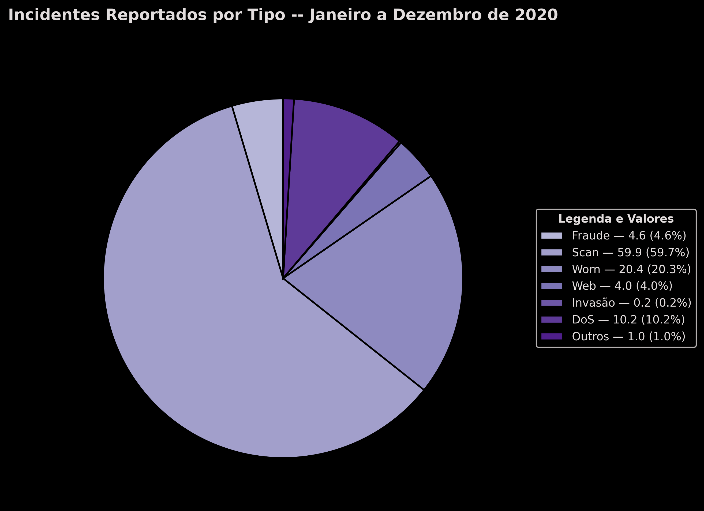

<p align="right" class="legenda">
  <ins><i>Incidentes Reportados por Tipo -- Janeiro a Dezembro de 2020</i></ins>
</p>

### Estatísticas de Ataques de Amplificação

&emsp; Os administradores de sistemas autônomos brasileiros (ASN) são notificados regularmente pelo CERT.br, cujas redes possuam sistema mal configurados que possam ser abusados para a realização de ataques de negação de serviço, com o objetivo de reduzir o número de redes brasileiras passíveis de serem abusadas para a realização de ataques DDoS.

&emsp; INSERIR **``Gráfico de Notificações de endereços de IP com serviços permitindo amplificação - (agosto/2022 até julho/2023)``**

### Estatísticas de DNS maliciosos

&emsp; É **definido** como `servidor DNS malicioso` aquele que está fornecendo respostas incorretas para nome(s) de domínio(s) de instituições vítima. Em geral, instituições financeiras, de comércio eletrônico, redes sociais e/ou domínios bastantes conhecidos.

&emsp; Seu **propósito** é direcionar os usuários para sites falsos, como parte de ataques de pharming.

&emsp; São **instalados**, em sua maioria, pelo próprio atacante contratando serviços de hospedagem ou de nuvem.

&emsp; O CERT.br notifica regularmente os ASNs que hospedam esses servidores, solicitando que sejam aplicadas as políticas adequadas para que o serviço seja retirando do ar.

&emsp; INSERIR **``Gráfico de Servidores DNS maliciosos no Brasil e fora do Brasil (ativos por dia) - (agosto/2021 até agosto/2023)``**

#### ATENÇÃO

> &emsp; Estas estatísticas são **relativas** a servidores DNS maliciosos (rogue) sendo usados para **sequestro de DNS (DNS Hijacking)**. Ou seja, um servidor:
>
> - autoritativa para os domínios das vítimas
> - recursivo aberto, para resposta às demais consultas
>
> &emsp; Estas estatísticas:
>
> - <spam style="color: red">não são</spam> de DNS invadidos;
> - <spam style="color: red">não são</spam> de envenenamento (cache poisoning);
> - <spam style="color: red">não são</spam> de sequestro de domínio (domain hijacking).

### Estatísticas de SPAM

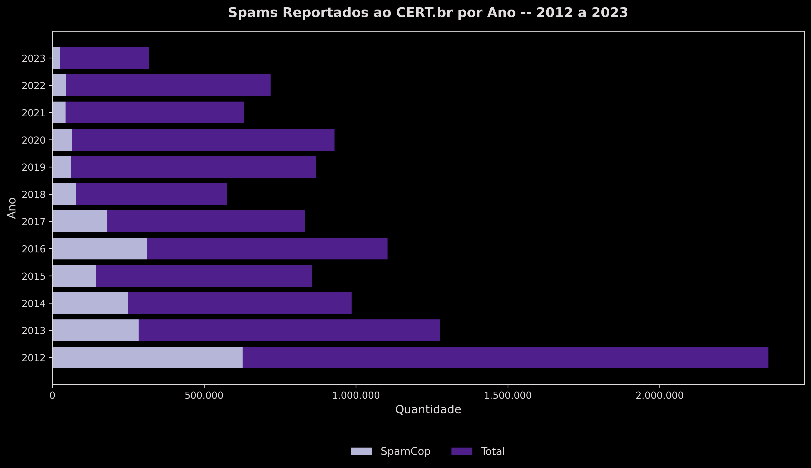

<p align="right" class="legenda">
  <ins><i>Gráfico de Spams Reportador ao CERT.br por Ano -- 2012 até 2023</i></ins>
</p>

### As 20 Portas TCP que mais sofreram varreduras em 2020

&emsp; As varreduras pelas portas TCP 23, 22, 81, 5555, 8000 e 8080 estão todas relacionadas com atividades de propagação de botnets de IoT, como a Mirai e suas variantes e a Bashlite e suas variantes. Os ataques nessas portas são tentativas de força bruta de credenciais ou tentativas de explorar vulnerabilidades nas interfaces de gerência de roteadores de banda larga ou de Wi-Fi.

&emsp; As portas que mais tiveram aumento de varreduras de 2019 para 2020 foram, na ordem de variação: 3389/TCP - 118%, 21/TCP - 101%, 1433/TCP - 85% e 23/TCP - 65%.

&emsp; Outro fato interessante é a continuidade da procura por serviços relacionados com e-mail, mais notadamente as portas POP3 (110/TCP), SMTPS (465/TCP). Este comportamento pode ser relacionado com o aumento de força bruta em serviços de e-mail que temos visto nas notificações de incidentes de segurança recebidas pelo CERT.br.

### Ataques por Número de Sistema Autônomo (ASN)

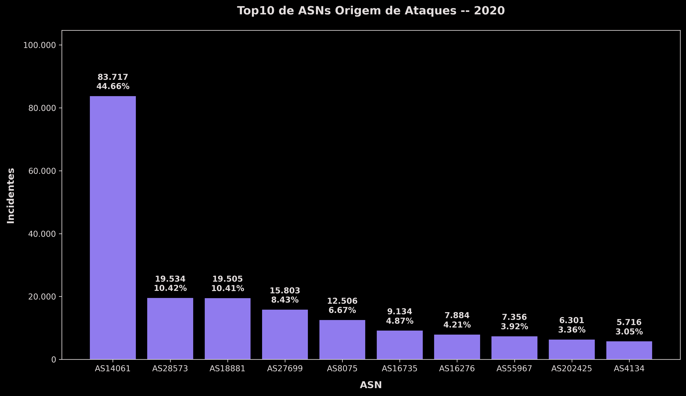

<p align="right" class="legenda">
  <ins><i>Top10 de ASNs Origem de Ataques -- 2020</i></ins>
</p>

### Ataques a Servidores Web

&emsp; A maioria absoluta das falhas de segurança nos sistemas desktop e web são por falha de programação:

- Falta de validação de entrada
- Falta de checagem de erros

&emsp; Como a segurança está sempre em último plano os testes de segurança são realizados depois dos lançamentos dos produtos, gerando uma série de atualizações

### Nomas ISO

- **ISO 27001** - Técnicas de segurança — Sistemas de gestão de segurança da informação — Requisitos
- **ISO 27002** – Técnicas de Segurança: Código de práticas para a gestão de segurança da informação

### Recomendações Mercadológicas

#### COBIT: Control Objectives for Information and related Technology

&emsp; É um guia de boas práticas apresentado como framework, dirigido para a gestão de tecnologia de informação (TI). 

&emsp; Mantido pelo ISACA (Information Systems Audit and Control Association), possui uma série de recursos que podem servir como um modelo de referência para gestão da TI, incluindo um sumário executivo, **um framework, objetivos de controle, mapas de auditoria, ferramentas para a sua implementação e principalmente, um guia com técnicas de gerenciamento [6]**.

#### Information Technology Infrastructure Library (ITIL)

&emsp; É um conjunto de boas práticas a serem aplicadas na infraestrutura, operação e manutenção de serviços de tecnologia da informação (TI). Foi desenvolvido no final dos anos 1980 pela CCTA (Central Computer and Telecommunications Agency) e atualmente está sob custódia da OGC (Office for Government Commerce) da Inglaterra.

&emsp; A ITIL busca promover a gestão com foco no cliente e na qualidade dos serviços de tecnologia da informação (TI). A ITIL lida com estruturas de processos para a gestão de uma organização de TI apresentando um conjunto abrangente de processos e procedimentos gerenciais, organizados em disciplinas, com os quais uma organização pode fazer sua gestão tática e operacional em vista de alcançar o alinhamento estratégico com os negócios.

&emsp; ITIL dá uma descrição detalhada sobre importantes práticas de IT com checklists, tarefas e procedimentos que uma organização de IT pode customizar para suas necessidades [7]

### Reflexão

> “É um fato bem conhecido que nenhuma outra parte da população recorre mais facilmente e rapidamente, aos mais recentes triunfos da ciência, do que a classe criminosa”.
> Inspetor John Bofield – Chicago Herald, 1888 [8].

### Referências

- [1] LEINER, Barry M.; KAHN, Robert E.; POSTEL, John; CERF, Vinton G.; KLEINROCK, Leonard; ROBERTS, Larry G.; Clark, David. D.; LYNCH, Daniel C.; WOLFF, Stephen. A Brief History of the Internet, Volume 39, Number 5, ACM SIGCOMM Computer Communication Review, October 2009.
- [2] Wikipedia: História da Internet. Documentação online. Disponível na URL: http://pt.wikipedia.org/wiki/Hist%C3%B3ria_da_Internet e acessado em 24 de Abril de 2012.
- [3] SHAHRYAR, Suheil. Web Security 2005. Documentação online. Disponível na URL: http://complianceandprivacy.com/WhitePapers/VeriSign-Web-Security-2005.pdf e acessado em 24 de Abril de 2012. 
- [4] HOEPERS, Cristine. Tratamento de Incidentes de Segurança e Tendências no Brasil. Documentação online. Disponível na URL: http://www.cert.br/docs/palestras/certbr-jornada-sisp2012.pdf e acessado em 24 de Abril de 2012.
- [5] STAMP, Mark. Information security: principles and practice, 1st Edition, John Wiley, 2005, ISBN: 20050471738484
- [6] Wikipedia: COBIT. Documentação online. Disponível na URL: http://pt.wikipedia.org/wiki/CobiT, acessado em 24 de Abril de 2012. 
- [7] Wikipedia: ITIL. Documentação online. Disponível na URL: http://pt.wikipedia.org/wiki/ITIL, acessado em 24 de Abril de 2012.
- [8] STAMDAGE, TOM. The Victorian Internet: The Remarkable Story of the Telegraph and the Nineteenth Century's On-Line Pioneers, Walker & Company; 1st edition (September 18, 2007), ISBN-13: 978-0802716040.
- [9] Estaơsticas do CERT.br – Disponível na URL: https://stats.cert.br/ e acessado em 15/08/2023
- Prof. Francisco DALADIER Marques JÚNIOR, PhD Instituto Federal de Educação, Ciência e Tecnologia da Paraíba (IFPB) - daladierjr@ifpb.edu.br


---

## Criptografia Básica

### Sumário

- [Criptografia Básica](#criptografia-básica)
  - [Sumário](#sumário)
  - [Introdução](#introdução)
  - [Como falar da Criptografia](#como-falar-da-criptografia)
    - [Conceitos de Criptografia](#conceitos-de-criptografia)
  - [Princípios de Kerckhoffs](#princípios-de-kerckhoffs)
  - [Cifra de Substituição Simples](#cifra-de-substituição-simples)
  - [Definição de Segurança](#definição-de-segurança)
  - [Cifra de Transposição Dupla](#cifra-de-transposição-dupla)
    - [Exemplo Prático](#exemplo-prático)
  - [Preenchimento de um Bloco por Vez (One Time Pad)](#preenchimento-de-um-bloco-por-vez-one-time-pad)
    - [Tabela XOR (ou Exclusivo)](#tabela-xor-ou-exclusivo)
  - [Projeto VENONA](#projeto-venona)
  - [Cifra de Livro de Código](#cifra-de-livro-de-código)
  - [A Taxonomia da Criptografia](#a-taxonomia-da-criptografia)

### Introdução

&emsp; Esta aula lançará as bases para outras aulas de criptografia. Vamos evitar o rigor matemático, tanto quanto possível, mas vamos tentar fornecer o suficiente dos detalhes para que você não somente entenda o que é a criptografia, mas também pode apreciar o porquê. A criptografia é centrada em 4 temas:

- Chave de criptografia simétrica
- Criptografia de chave pública
- Funções de hash
- Criptoanálise avançada

### Como falar da Criptografia

&emsp; A terminologia básica da criptografia inclui o seguinte [1]:

- **Criptologia** é a arte e a ciência de fazer e quebrar "códigos secretos."
- **A criptografia** é a criação de "códigos secretos."
- **Criptoanálise** é a ruptura de "códigos secretos."
- **Crypto** é um sinônimo para qualquer ou todas as anteriores (e mais).

&emsp; Um exemplo de criptografia é quando uma mensagem é encriptada por uma chave, é passada para o destino, é desencriptada por outra chave e assim é possível visualizar.

&emsp; Usando qualquer tipo de criptografia, o objetivo é ter um sistema onde uma chave é necessária para recuperar a mensagem cifrada. Mesmo que o atacante tenha conhecimento completo dos algoritmos utilizados e muitas outras informações, só é possível recuperar a mensagem com a chave.

#### Conceitos de Criptografia

- **Chave (key) / cifra / Sistema de Encriptação**: é usada para criptografar dados.
- O **dado original** é conhecido como texto plano (plaintext)
- O **resultado da criptografia** é o texto cifrado (ciphertext)
- **Descriptografamos** o texto cifrado, para recuperar o texto plano original. 

- **Chave de cifra simétrica** é usada para para criptografia e descriptografia, como ilustrado na "caixa preta" da figura anterior.
- **Chave Pública ou Assimétrica** onde as chaves de criptografia e descriptografia são diferentes.

&emsp; Desde que sejam usadas chaves diferentes, é possível fazer uma **criptografia de chave pública**. Nesta, a chave de criptografia é apropriadamente conhecida como **chave pública**, enquanto a chave de decodificação, que deve permanecer em segredo, é a **chave privada**.

### Princípios de Kerckhoffs

&emsp; Cifras não precisam necessariamente serem secretas, mas elas devem ser capazes de caírem nas mãos do inimigo sem inconveniência (sem causar danos), isto é, o projeto da cifra não é secreto.

&emsp; Qual é o ponto do Princípio de Kerckhoffs? Afinal, a vida deve certamente ser mais difícil para o atacante se ele não sabe como funciona uma cifra. Embora isso possa ser verdade, também é verdade que **os detalhes dos sistemas de encriptação raramente permanecem em segredo por muito tempo**. Esforços de engenharia reversa podem facilmente recuperar os algoritmos de software e algoritmos embutidos em hardware são suscetíveis a ataques semelhantes.

&emsp; Os algoritmos de criptografia secretos têm uma longa história de não serem seguros, uma vez que o algoritmo tenha sido exposto ao escrutínio público. Por estas razões, a comunidade de criptografia não irá aceitar um algoritmo como
seguro até que ele resista a análises extensas de criptógrafos, por um período de tempo prolongado.

&emsp; A questão de fundo é que qualquer sistema de encriptação não satisfaz. Ou seja, uma cifra é **“culpada até que se prove inocente”**.

### Cifra de Substituição Simples

&emsp; Em uma cifra de substituição simples, a mensagem é criptografada substituindo a letra do alfabeto por **n posições** à frente da cada letra. Por exemplo, com **n = 3**, a substituição que atua como a chave é:

| Mensagem | Mensagem Criptografada |
| :------: | :--------------------: |
| A | D |
| B | E |
| C | F |
| D | G |
| E | H |
| F | I |
| G | J |
| H | K |
| I | L |
| J | M |
| K | N |
| L | O |
| M | P |
| N | Q |
| O | R |
| P | S |
| Q | T |
| R | U |
| S | V |
| T | W |
| U | X |
| V | Y |
| W | Z |
| X | A |
| Y | B |
| Z | C |

&emsp; Seguiremos a convenção de que a mensagem está em letras minúsculas e a mensagem criptografada está em letras maiúsculas.

&emsp; Neste exemplo, a chave podia indicar sucintamente como 3 a quantidade de deslocamentos a cada chave. Usando a chave 3, pode-se criptografar a mensagem de texto plano:

- Mensagem: fourscoreandsevenyearsago (quatrocentos e sete anos atrás)
- Mensagem criptografada: IRXUVFRUHDAGVHYHABHDUVDIR

&emsp; A abordagem de **força bruta tenta todas as chaves possíveis**, até que ache exaustivamente uma chave. Uma vez que este ataque é sempre uma opção, é necessário (embora longe de ser suficiente) que o número de chaves possíveis seja muito grande, assim o atacante simplesmente pode julgá-las num período de tempo razoável.

&emsp; Qual o tamanho de uma chave grande o suficiente? Suponha que o atacante tem um computador incrivelmente rápido que é capaz de testar 240 $2^{40}$ chaves a cada segundo. Então uma cifra de tamanho $2^{56}$ pode ser esgotado em $2^{16}$ segundos, ou cerca de 18 horas, enquanto um keyspace (cifra) de tamanho $2^{64}$ levaria mais de meio ano para ser achada.

PBFPVYFBOXZTYFPBFEQJHDXXQVAPTPOJKTOYQNIPBVWLXTOXBTFXQWAXBVCXQWAXFQJVWLEỌNTOZÇGGOLFXQWAKVWLXQNAEBIPBEXFOVXGTVJVWLBTPQWAEBFPBFHCVLXBQUFЕЛЕИСЮРЕОИРОСИРРВЕТІХРЕНХИНУЕАСЕОТНЕЕЕВОИЕТЕНУВОРОТЕАТУЕТОЮХОНЕТDРТОСНЕОРВОНАОТТТОПХОНЕООРОТАDННІХОVАРВЕZОНСРИРРНРРЭТPRОЮКFARVYУDZВОТНРВОРОЈТООТОСНЕОАРВЕЕОЈНОХХОИАИХЕВОРЕВZВУБОЈТИЕЕАСЕССЕНОЮАUИІНІQHGFXVAFXOHFUFHILTTAVWAFFANTEVOITDНЕНЕQАIТІХРЕНХАFQНЕFZQWGFLVWРТОFЕА

&emsp; Será muito trabalhoso para o atacante tentar todas as $2^{88}$ chaves possíveis ($2^{64}$ ≈ 26!), mas ela pode ser mais inteligente? Suponha que a mensagem está em Inglês, o atacante pode fazer uso da Contagens da Frequência de Letras em Inglês, juntamente com Contagem da Frequência para o texto cifrado.

&emsp; A partir da Contagem de Frequência do texto cifrado, o atacante pode ver que "F" é a letra mais comum na mensagem de texto cifrado. "E" é a letra mais comum no idioma Inglês. O atacante, portanto, supõe que é provável que o "F" foi substituída por "E." Continuando, o atacante pode tentar prováveis substituições até que ela reconheça as palavras.

&emsp; Inicialmente, a palavra mais fácil de determinar poderia ser a primeira palavra, pois o atacante não sabe onde são os espaços do texto. Desde que a terceira letra é "E", e dada a contagens de alta frequência das duas primeiras letras, o atacante pode razoavelmente supor que a primeira palavra do texto original é o "the". Fazendo essas substituições no texto cifrado restante, ele será capaz de adivinhar mais letras no enigma, e este será rapidamente desvendado. O atacante provavelmente cometerá erros durante a descoberta, mas com o uso racional da informação estatística disponível, ela vai encontrar o texto original em menos de 4450 mil anos.

### Definição de Segurança

&emsp; Existem várias definições razoáveis de uma cifra segura. Idealmente, nós gostaríamos de ter prova matemática de que não há ataque viável no sistema.

&emsp; Um sistema de encriptação seguro com um pequeno número de chaves poderia ser mais fácil de quebrar do que um sistema criptográfico inseguro com um grande número de chaves.

&emsp; A justificativa para a nossa definição é que, se um ataque de atalho (shortcut attack) é conhecido, o algoritmo falha ao fornecer "anunciados" em nível de segurança, conforme indica o tamanho da chave. Tal ataque indica que a cifra possui falha de projeto. Na prática, temos de selecionar uma cifra que seja segura (no sentido de nossa definição) e tem uma chave bastante grande para que uma busca exaustiva de chaves seja impraticável.

### Cifra de Transposição Dupla

&emsp; Para criptografar com uma cifra de transposição dupla, primeiro escreva o texto simples em um vetor de tamanho determinado e depois permute as linhas e colunas de acordo com permutações especificadas. Por exemplo, suponha que nós escrevemos o texto plano attackatdawn em uma matriz 3 × 4:

$$
\begin{bmatrix}
a & t & t & a \\
c & k & a & t \\
d & a & w & n
\end{bmatrix}
$$

&emsp; Agora, se transpormos (ou permutarmos) as linhas de acordo com (1, 2, 3) → (3, 2, 1) e, em seguida transpormos as colunas de acordo com (1, 2, 3, 4) → (4, 2, 1, 3), obtemos:

$$
\begin{bmatrix}
  a & t & t & a \\
  c & k & a & t \\
  d & a & w & n
\end{bmatrix}

\xRightarrow[(1, 2, 3) \rightarrow (3, 2, 1)]{Linhas}

\begin{bmatrix}
  d & a & w & n \\
  c & k & a & t \\
  a & t & t & a
\end{bmatrix}

\xRightarrow[(1, 2, 3, 4) \rightarrow (4, 3, 2, 1)]{Colunas}

\begin{bmatrix}
  n & a & d & w \\
  t & k & c & a \\
  a & t & a & t
\end{bmatrix}
$$

#### Exemplo Prático

&emsp; O texto final cifrado seria: **NADWTKCAATAT**.

&emsp; Para a transposição dupla, a chave consiste no tamanho da matriz, e as permutações de linhas e colunas. O destinatário que conhece a chave pode simplesmente colocar o texto cifrado no tamanho apropriado da matriz e desfazer as permutações para recuperar o texto.

$$
\begin{bmatrix}
  N & A & D & W \\
  T & K & C & A \\
  A & T & A & T
\end{bmatrix}

\xRightarrow[(4, 2, 1, 3) \rightarrow (1, 2, 3, 4)]{Colunas (Reverso)}

\begin{bmatrix}
  D & A & W & N \\
  C & K & A & T \\
  A & T & T & A
\end{bmatrix}

\xRightarrow[(3, 2, 1) \rightarrow (1, 2, 3)]{Linhas (Reverso)}

\begin{bmatrix}
  A & T & T & A \\
  C & K & A & T \\
  D & A & W & N
\end{bmatrix}
$$

- Texto recuperado: **attackatdown**.

&emsp; Ao contrário de uma substituição simples, a transposição dupla não faz nada para disfarçar as letras que aparecem na mensagem. Mas isso parece não impedir um ataque que se baseia em informações estatísticas contidas no texto original, uma vez que as estatísticas do texto plano são debruçadas ao longo do texto cifrado. A transposição dupla não é uma cifra trivial de quebrar. A ideia de informação de texto plano manchado com o texto cifrado é tão útil que é empregado por cifras de blocos modernas.

### Preenchimento de um Bloco por Vez (One Time Pad)

&emsp; Também conhecido como **Vernam**, é um sistema de encriptação comprovadamente seguro. Historicamente foi utilizada em vários momentos, mas não é muito prática para a maioria das situações. No entanto, ele serve para ilustrar alguns conceitos importantes.

&emsp; Para simplificar, vamos considerar um alfabeto com apenas **oito letras**. O nosso alfabeto e a correspondente representação binária de letras são dadas na Tabela. É importante notar que o mapeamento entre as letras e os bits não é segredo. Esse mapeamento serve como um efeito similar com o código ASCII, que não é secreto.

&emsp; Suponha que uma espiã chamada Alice quer criptografar a mensagem de texto plano: **heilhitler**.

&emsp; Usando um bloco por vez, ela consulta a Tabela a seguir para converter as letras para uma string de bits: **001 000 010 100 001 010 111 100 000 101**.

| Letra | Binário |
| :---: | :------ |
| e | 000 |
| h | 001 |
| i | 010 |
| k | 011 |
| l | 100 |
| r | 101 |
| s | 110 |
| t | 111 |

#### Tabela XOR (ou Exclusivo)

| x | y | z |
| :-: | :-: | :-: |
| 0 | 0 | 0 |
| 0 | 1 | 1 |
| 1 | 0 | 1 |
| 1 | 1 | 0 |

---------

&emsp; Um bloco por vez exige uma chave que consiste de uma sequência de bits selecionados aleatoriamente que têm o **mesmo comprimento da mensagem**. A chave é então calculada com **XOR (ou exclusivo)** com o texto para produzir o texto cifrado.

&emsp; Denotamos o bit XOR de x com o bit y, como x ⊕ y. Desde x ⊕ y ⊕ y = x. Logo, a decodificação é realizada também por XOR com a mesma chave do texto cifrado.

| | h | e | i | l | h | i | t | l | e | r |
| :--- | :---: | :---: | :---: | :---: | :---: | :---: | :---: | :---: | :---: | :---: |
| **ciphertext** | 001 | 000 | 010 | 100 | 001 | 010 | 111 | 100 | 000 | 101 |
| **key** | 111 | 101 | 110 | 101 | 111 | 100 | 000 | 101 | 110 | 000 | 
| **plaintext** | 110 | 101 | 100 | 001 | 110 | 110 | 111 | 001 | 110 | 101 |
| | s | r | l | h | s | s | t | h | s | r |

&emsp; Vamos considerar um par de cenários:

> 1ª) Suponha que Alice tem um inimigo, Charlie, dentro de sua organização de espionagem. Charlie afirma que a chave real usada para criptografar mensagens de Alice é: **101 111 000 101 111 100 000 101 110 000**.

&emsp; Quando Bob decifra o texto cifrado usando essa chave, ele encontrará:

| | h | e | i | l | h | i | t | l | e | r |
| :--- | :---: | :---: | :---: | :---: | :---: | :---: | :---: | :---: | :---: | :---: |
| **ciphertext** | 110 | 101 | 100 | 001 | 110 | 110 | 111 | 001 | 110 | 101 |
| **key** | 101 | 111 | 000 | 101 | 111 | 100 | 000 | 101 | 110 | 000 | 
| **plaintext** | 011 | 010 | 100 | 100 | 001 | 010 | 111 | 100 | 000 | 101 |
| | k | i | l | l | h | i | t | h | e | r |

> 2ª) Suponha que Alice é capturada por seus inimigos, que também interceptaram o texto cifrado. Os sequestradores estão ansiosos para ler a mensagem, e Alice é incentivada a fornecer a chave para esta mensagem “secreta”. Alice alega que ela é na verdade um agente duplo e para provar que é, ela afirma que a chave é: **111 101 000 011 101 110 001 011 101 101**.

&emsp; Quando os captores de Alice "decifrarem" o texto cifrado usando esta chave, eles acham a mensagem a seguir. Por não estarem muito bem informados sobre criptografia, felicitam Alice por seu patriotismo e a libertam.

| Mensagem Enviada | s | r | l | h | s | s | t | h | s | r |
| --- | --- | --- | --- | --- | --- | --- | --- | --- | --- | --- |
| ciphertext | 110 | 101 | 100 | 001 | 110 | 110 | 111 | 001 | 110 | 101 |
| key | 111 | 101 | 000 | 011 | 101 | 110 | 001 | 011 | 101 | 101 |
| plaintext | 001 | 000 | 100 | 010 | 011 | 000 | 110 | 010 | 011 | 000 |
| Mensagem Receida | H | E | L | I | K | E | S | I | K | E |

&emsp; Estes exemplos indicam porque um bloco por vez é comprovadamente seguro. Se a chave for escolhida aleatoriamente, então um atacante, que vê o texto cifrado não tem nenhuma informação sobre a mensagem de que não seja o seu comprimento. 

&emsp; Isto é, com o texto cifrado, de qualquer texto original, pode ser gerada/escolhida uma chave de qualquer comprimento da mensagem, e todos textos planos possíveis são igualmente prováveis. 

&emsp; E uma vez que a mensagem poderia ser preenchida com qualquer número de letras aleatórias antes de criptografia, a informação do comprimento é inútil para qualquer um. Assim, o texto cifrado não fornece nenhuma informação relevante a todos, sobre o texto original. Este é o sentido que o um bloco por vez é comprovadamente seguro.

&emsp; Evidentemente, isso pressupõe que a cifra é usada corretamente. O bloco, ou chave, deve ser escolhido de forma aleatória, usada apenas uma vez, e deve ser conhecida apenas pelo emissor e receptor.

&emsp; No entanto, existe um sério obstáculo para a estratégia: **o bloco é do mesmo comprimento que a mensagem**, que é a chave a ser transmitida com segurança ao destinatário antes de o texto cifrado poder ser decifrado.

&emsp; Por que é que o um bloco por vez pode ser usado apenas uma vez?

> Suponha que temos duas mensagens de texto simples P1 e P2, codificado como C1 = P1 ⊕ K e C2 = P2 ⊕ K, ou seja, temos duas mensagens criptografadas com o bloco K por vez. Na criptoanálise isso é conhecido como um ataque de profundidade (depth). No caso de um bloco por vez em profundidade
>
> C1 ⊕ C2 = P1 ⊕ K ⊕ P2 ⊕ K = P1 ⊕ P2

### Projeto VENONA

&emsp; O projeto VENONA é um exemplo interessante de utilização do mundo real de um bloco por vez. Na década de 1930 e 1940, espiões soviéticos introduzem nos Estados Unidos a técnica de um bloco por vez. Os espiões usaram essas chaves para criptografar mensagens importantes, que foram então enviadas de volta para Moscou. 

&emsp; Estas mensagens foram tratadas com as operações de espionagem mais sensível daquela época. Em particular, o segredo do desenvolvimento da primeira bomba atômica foi um foco de grande parte da espionagem. Rosenberg, Alger Hiss, e muitos outros espiões foram identificados - e outros espiões nunca identificados.

### Cifra de Livro de Código

&emsp; Uma cifra de livro de código clássica é, literalmente, um dicionário como um livro que contém as palavras e as suas palavras-código correspondentes. A tabela a seguir contém um trecho de um famoso livro de códigos utilizado pela Alemanha durante a Primeira Guerra Mundial.

| Plaintext | Ciphertext |
| :-------: | :--------: |
| Februar | 13605 |
| fest | 13732 |
| finanzielle | 13850 |
| folgender | 13918 |
| Frieden | 17142 |
| Friedenschluss | 17149 |

&emsp; Por exemplo, para criptografar “Februar”, a palavra inteira foi substituída com a chave de 5 dígitos 13.605. 

&emsp; O livro de códigos da Tabela foi utilizado para criptografia, enquanto um livro de códigos correspondentes, combinado com chaves de 5 dígitos em ordem numérica, foi utilizado para descriptografia do livro de código. 

&emsp; Um livro de código é uma cifra
de substituição, mas as substituições estão longe de serem
simples, pois as substituições são para palavras inteiras, ou
mesmo frases.

&emsp; Cifras de bloco modernos utilizam algoritmos complexos para gerar texto cifrado em texto puro (e vice-versa), mas a um nível superior, uma cifra de bloco pode ser visto como um livro de códigos, onde cada chave escolhida pode determinar um livro de códigos distinto.

### A Taxonomia da Criptografia

&emsp; Embora a distinção entre as chaves públicas e chaves simétricas pode parecer menor, acontece que a criptografia de chave pública pode fazer algumas coisas úteis que são impossíveis de alcançar com cifras simétricas.

&emsp; Na criptografia de chave pública, as chaves de criptografia podem se tornar públicas. Se, por exemplo, for colocada a sua chave pública na Internet, qualquer pessoa com uma conexão com a Internet pode criptografar uma mensagem para você, sem um acordo prévio sobre a chave.

&emsp; Isto é um contraste com uma cifra simétrica, onde os participantes **devem concordar** com uma chave **com antecedência**.

&emsp; Antes da adoção de uma chave pública de criptografia, a segurança de entrega de chaves simétricas foi o calcanhar de Aquiles da criptografia moderna.

&emsp; Criptografia de chave pública tem outro recurso extremamente útil e surpreendente, para o qual não existe paralelo no mundo de chave simétrica. Suponha que uma mensagem é "codificada", com a chave privada em vez da chave pública. Desde que a chave pública é pública, qualquer pessoa poderá decifrar a mensagem. À primeira vista, essa criptografia pode parecer inútil, no entanto, ela pode ser usada como uma forma digital de uma assinatura manuscrita: qualquer um pode ler a assinatura, mas apenas o assinante poderia ter criado a assinatura.

&emsp; Qualquer coisa que podemos fazer com uma cifra simétrica também pode-se realizar com um sistema de encriptação de chave pública. Criptografia de chave pública também nos permite fazer coisas que não podem ser realizadas com uma cifra simétrica. Então porque não usar a criptografia de chave pública para tudo?

&emsp; **Velocidade**: Criptografia de chave simétrica tem várias ordens de grandeza mais rápida do que chaves públicas. Como resultado, a chave de criptografia simétrica é usada para criptografar a grande maioria dos dados de hoje. No entanto, a criptografia de chave pública tem um papel crítico a desempenhar na segurança da informação moderna.

&emsp; Cada uma das cifras clássicas discutidas anteriormente são cifras simétricas. Modernas cifras simétricas podem ser subdivididos em **cifras de fluxo** e **cifras de bloco**.

- **Cifras de fluxo** generalizam a abordagem de um bloco por vez, sacrificando a segurança demonstrada por uma chave, que é de duração razoável.
- **Cifra de bloco** é, em certo sentido, a generalização de um livro de códigos. A chave determina o livro de códigos, e enquanto a chave permanece fixa, o livro de código utilizado não muda. Inversamente, quando as chaves mudam, um livro de códigos diferente é selecionado.

&emsp; Enquanto cifras de fluxo dominaram a pós-era da Segunda Guerra, cifras de blocos são as mais utilizadas na criptografia simétrica, com algumas exceções notáveis. De modo geral, cifras de blocos são mais fáceis para otimizar para implementações de software, enquanto cifras de fluxo são geralmente mais eficiente no hardware.

---

## Criptografia de Chave Simétrica

- Aula: 26/03/2026

### Tópicos

- [Criptografia de Chave Simétrica](#criptografia-de-chave-simétrica)
  - [Tópicos](#tópicos)


---

## Márquinas Virtuais

### Estabelecenco Conexão

#### VM

- liga a máquina
- login (ads; 654123)
- dhclient enp0s8
- ifconfig enp0s8

#### Terminal do Computador

```bash
root@ubuntuserver:/home/ads# ssh ads@[ip_enp0s8]
```

#### VM

```bash
sudo su
root@ubuntuserver:/home/ads# docker start80; docker attach 80
root@80987d9d1e6c:/# ping 8.8.8.8
root@80987d9d1e6c:/#
```

### Verificando se a conexão

#### VM (fora do container)

```bash
iptables --policy FORWARD ACCEPT
iptables -t nat -A POSTROUTING -j MASQUERADE
```

#### Container Docker (poweshell ou terminal)

```bash
ping 8.8.8.8
```

#### Problema no Container

Caso o ping ainda não seja possível, execute o comando a seguir:

```bash
nft flush ruleset
```

---

